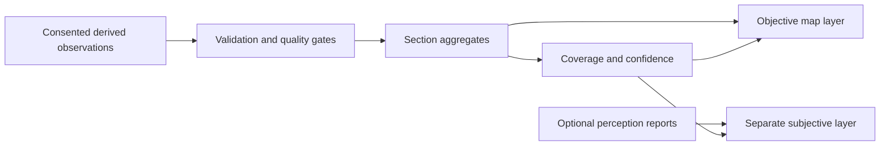

# H11 — Public map

The public map translates versioned, section-level evidence into a passenger-facing quieter-journey view. It must make coverage and uncertainty as visible as the acoustic result.

**For:** passengers, map designers, researchers, journalists, and `tunes-web` implementers.

**Assumptions:** map geometries use directed station-to-station **sections**; crowd data is survey-grade at best; “quieter” is comparative within the released dataset.

## Goals

- Compare observed acoustic conditions between plausible journey sections.
- Show where evidence is dense, sparse, conflicting, or absent.
- Keep measured acoustics separate from reported passenger experience.
- Let every displayed result be traced to a dataset, schema, and pipeline version.
- Remain readable without implying engineering-grade or health-risk authority.

The first map is expected to use L2 section aggregates. Record-level observations and reprocessed metrics remain separate data layers; passenger-facing rankings and styles are interpretations.

## Aggregation and confidence

Each section summary should expose:

| Element | Why it is required |
| --- | --- |
| Sample count | Distinguishes repeated evidence from isolated observations |
| Distribution or spread | Avoids presenting one value as universal |
| Quality-tier mix | Prevents weak and strong contributions appearing equivalent |
| Uncertainty dimensions | Separates acoustic, calibration, alignment, and metadata limits |
| Scope and recency | States what network and release the map represents |
| Exclusions and caveats | Makes filtering decisions auditable |

Objective and subjective layers require independent sample counts. A session-level perception report must not be copied onto every section.

## Interpolation

TUNES does **not** fill unobserved or low-sample sections with confident acoustic values. Empty sections remain empty or **insufficient evidence**.

Topology snapping is not acoustic interpolation: it assigns a recording interval to a legal network section when GPS is weak. Reprocessing may estimate model-adjusted values only under a documented, versioned method; it creates a new release and does not overwrite observations.

Confidence maps may visualise coverage, tier mix, or a named uncertainty dimension. They must not collapse all uncertainty into an unexplained “accuracy” score.

> Future work
>
> Minimum sample gates, aggregate estimators, interval methods, recency rules, and any model-based spatial inference require pilot evidence and an ADR before becoming public-map defaults.

## Colour and accessibility

Colour may encode a named acoustic metric or a clearly labelled perception measure, never both at once. The legend must state the metric, weighting, duration/aggregation basis, release, and insufficient-data state.

- Do not use colour as the only carrier of meaning.
- Do not imply false precision through narrow bands or smooth gradients.
- Keep low-confidence and missing-data states visually distinct from “quiet”.
- Provide text or pattern equivalents for confidence and coverage.

> Future work
>
> The repository does not yet define a canonical palette, breakpoints, or accessibility-tested scale. These belong to `tunes-web` design work informed by pilot distributions and user testing.

## Privacy

The map consumes derived, minimised data. Raw recordings are never exposed because carriage recordings may contain incidental passenger, staff, and announcement speech. Publishing waveform audio would increase re-identification and surveillance risk without being necessary for the default map.

Public layers must also avoid contributor identity, stable cross-release personal identifiers, precise location trails, identifying free text, and combinations of rare route and exact time that enable re-identification. Pseudonymous data is still personal data.

## Related Documents

[How it works](./H04-how-it-works.md) · [Privacy](./H05-privacy.md) · [Quality tiers](./H06-quality-tiers.md) · [Legal and governance](./H11-legal-governance.md) · [Public data model](./machine/architecture/public-data-model.md) · [Open data and reproducibility](./machine/research/10-open-data-reproducibility.md) · [Subjective experience](./machine/research/09-subjective-experience.md) · [Claim language](./machine/decisions/ADR-011-claim-language.md)
