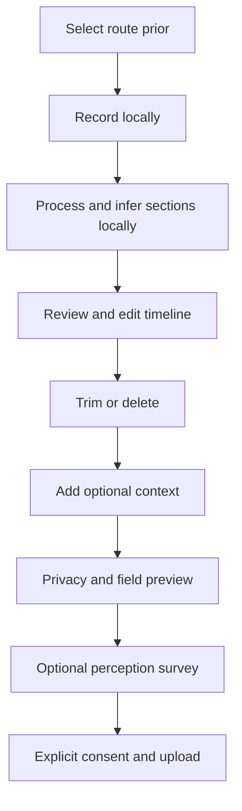

# H14 — Recorder

The mobile recorder is the `tunes-ios` contribution client. It records locally, helps the passenger align the journey, and uploads only reviewed and consented derived data by default.

**For:** contributors, product designers, researchers, and `tunes-ios` implementers.

**Assumptions:** iPhone-first; offline-first during collection; station-to-station sections are the comparison unit; raw PCM stays on the device by default.

## Recording workflow

Nothing leaves the device before preview and consent.

### Before and during recording

- Select system, line, direction, origin, destination, and branch when topology requires it.
- Keep the phone in hand with the microphone unobstructed; avoid handling it during measurement.
- Record audio and available motion data locally.
- Continue collection without network access.
- Preserve detected clipping, interruption, audio-route changes, and sensor gaps as quality evidence for later review.

The casual path should not require exact rolling-stock, train-unit, or carriage numbers.

## Carriage and seat context

After recording, the recommended coarse carriage selector is **front / middle / rear of train**. Optional context may include position within the carriage (**end / centre / near doors / near bogie**) and posture (**sitting / standing**).

These are passenger metadata, not professional measurement positions. They help interpret variation but do not upgrade acoustic quality.

> Future work
>
> The repository does not define a literal seat-map selector or exact seat identifiers. Any seat selector requires user testing and a generic representation that does not hard-code one train interior.

## GPS and station alignment

GPS is optional evidence, not the primary underground clock. The recorder combines:

- user-selected route and network topology
- motion and acceleration/braking cues
- dwell and acoustic-envelope changes
- door/chime event hints
- optional GPS where accuracy is useful

The preferred result is a snapped section ID and relative timeline, not a high-rate location trail. Timetables are soft priors, not ground truth.

## Editing timeline

The post-recording editor follows a subtitle/chapter model:

1. Show a local level envelope and proposed from→to section blocks.
2. Allow boundaries to be dragged, stretched, split, merged, or reassigned within legal topology.
3. Mark dwell, held-between-stations, walking/interchange, partial, gap, and trimmed intervals.
4. Recalculate duration `T` when boundaries change.
5. Require explicit confirmation before public-comparison eligibility.

Ambiguous intervals should be excluded or flagged, never silently filled.

## Offline mode and upload pipeline

Recording, local processing, alignment, editing, and consent review must work without connectivity. A consented derived package may be queued until a connection is available.

After upload, `tunes-web` validates the schema and consent metadata, applies quality gates, associates confirmed sections, and produces aggregates. Periodic versioned open releases are owned by `tunes`.

> Future work
>
> Retry rules, queue persistence, intake authentication, idempotency, withdrawal API behaviour, and server error contracts are not specified in this repository.

## Metadata

### Collected or derived for the default scientific path

| Group | Examples |
| --- | --- |
| Journey | Network profile, line, direction, section IDs, duration, confirmed boundaries |
| Acoustics | Separate level, peak, and band summaries |
| Provenance | Device model, OS, app and processing versions, calibration state |
| Quality | Tier, clipping/dropout/processing/placement flags, confidence dimensions |
| Consent | Timestamp, consent class, upload-preview acknowledgement, fields sent, withdrawal handle |
| Optional context | Phone placement, train third, crowding, posture, carriage position |
| Optional perception | Structured responses, separate from acoustic metrics; instrument versioning is planned |

Raw audio and detailed sensor traces may be collected locally to support processing, but are not part of the default upload.

### Intentionally not required or not published by default

- raw waveform audio
- contributor identity or stable public personal identifiers
- precise GPS trails
- exact train/unit or carriage identity in casual mode
- exact occupancy percentages
- medical diagnoses or hearing-health claims
- identifying free text
- announcement transcripts or a public speech archive

Any future research-restricted raw or excerpt path requires a separate protocol, explicit consent, legal and ethics review, access controls, and retention rules. It is not a casual toggle.

## Related Documents

[How it works](./H04-how-it-works.md) · [Privacy](./H05-privacy.md) · [Quality tiers](./H06-quality-tiers.md) · [Privacy and research ethics](./machine/research/05-privacy-ethics.md) · [Journey alignment](./machine/research/07-journey-alignment.md) · [Passenger metadata](./machine/research/08-passenger-metadata.md) · [Data-flow boundaries](./machine/architecture/data-flow-and-privacy-boundaries.md) · [Raw-audio policy](./machine/decisions/ADR-004-raw-audio-policy.md) · [Derived-only default](./machine/decisions/ADR-005-derived-only-default.md) · [Subjective timing](./machine/decisions/ADR-010-subjective-timing.md) · [Derived upload schema](../schemas/v0.1.0/derived-upload-package.schema.json)
