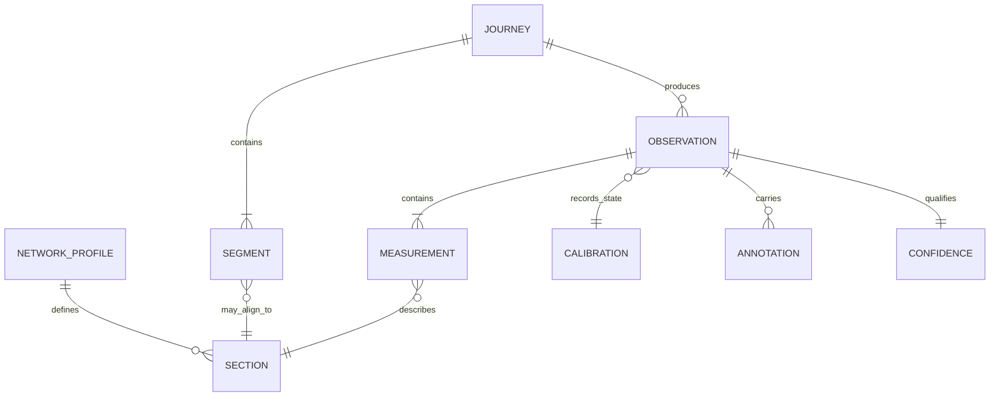
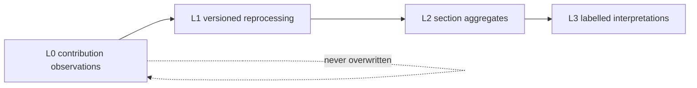

# H16 — Schema

The data model keeps railway topology, passenger contributions, derived acoustics, calibration evidence, annotations, and confidence separable. This supports reprocessing and portability without erasing provenance.

**For:** schema authors, researchers, pipeline implementers, and data users.

**Assumptions:** the current JSON Schemas are a `v0.1.0` working draft; **section** is the canonical station-to-station comparison unit; London is profile data, not the core ontology.

## Conceptual model

The terms below explain responsibilities. They are not all frozen JSON entities.

| Entity | Why it exists |
| --- | --- |
| **Journey** | Holds one passenger trip context: route prior, direction, timing and the ordered sections expected or observed. A recorder session may represent a journey attempt, but session and journey should not be assumed identical in every future workflow. |
| **Segment** | Represents a bounded interval in the recording timeline. It distinguishes in-motion sections from dwell, hold, walking, gap and trimmed intervals. Public comparisons use the canonical term **section** for the directed interval between consecutive stations. |
| **Observation** | Preserves what one contribution reported under one set of conditions. It is the provenance-bearing evidence that must not be overwritten by later processing. |
| **Measurement** | Stores objective derived quantities for a section and duration, with weighting and units kept explicit. It prevents context or interpretation from being mistaken for measured acoustics. |
| **Calibration** | States the evidence behind device response or correction. Calibration state and correction provenance remain separate from the measured value and quality tier. |
| **Annotation** | Describes exclusions, quality events, alignment edits, source candidates, or optional passenger reports without altering the observation. Subjective reports remain structurally separate from objective measurements. |
| **Confidence** | Describes named limits such as acoustic level, frequency content, journey assignment, device calibration, metadata and subjective response. It prevents one universal trust score. |

## Relationships

## Why these boundaries matter

### Journey and section

A journey gives ordered context; a section gives a stable comparison cell. Direction is part of section identity because A→B and B→A may differ. Duration `T` belongs with every equivalent-level measurement.

### Observation and measurement

An observation is an encounter: device, app, conditions, consent, alignment, flags and optional context. A measurement is one objective result inside it. Keeping them separate permits a future pipeline to derive new measurements from the same retained evidence while issuing a new release.

### Calibration and confidence

Calibration describes what was done: unknown device, model profile, individual field offset, external calibrated microphone, or reference protocol. Confidence describes what can reasonably be inferred. Neither silently converts a phone into a Class 1 instrument.

### Annotation

Annotations preserve changes of interpretation without mutating the acoustic record. Examples include clipping flags, a user-corrected boundary, a held-between-stations exclusion, or a separately scoped perception report. Taxonomy labels need provenance and versioning before becoming canonical schema.

## Current implementation

The `v0.1.0` schemas currently encode:

- generic network profiles and stable section IDs
- derived upload packages containing section measurements
- duration, separate acoustic metrics, device/app provenance
- calibration state, quality tier and quality flags
- nullable uncertainty dimensions
- alignment confirmation and an optional `subjective` object for perception answers
- consent class, preview acknowledgement and withdrawal handle

The conceptual model is broader than this prototype. In particular, `Journey`, general timeline `Segment`, standalone `Observation`, `Annotation`, and release schemas are not yet independent JSON contracts.

> Future work
>
> D-SEC and ADR-002 establish the section unit and generic core. Remaining work is to reconcile the prototype perception fields with the versioned perception-instrument research, define migration and compatibility policy, and add release manifests and data dictionaries. Exact future field names and SemVer policy remain open.

## Extensibility rules

1. Add new cities and networks as versioned profiles, not new city-specific root types.
2. Prefer additive optional fields and versioned enums.
3. Require a major version or documented equivalent for breaking interpretation.
4. Keep source observations immutable; corrections supersede and reprocessing creates a new release.
5. Pin schema, network profile, capture app and processing pipeline versions.
6. Do not merge objective acoustics, subjective perception, quality, or confidence into one field.
7. Record why a schema change is needed and use an ADR when it changes scientific meaning or compatibility.

## Related Documents

[Glossary](./H10-glossary.md) · [Measurement philosophy](./H12-measurement-philosophy.md) · [Recorder](./H14-recorder.md) · [Portability](./H17-portability.md) · [Schema README](../schemas/README.md) · [Journey model](./machine/research/06-railway-journey-model.md) · [Journey segmentation](./machine/architecture/journey-segmentation-model.md) · [Data-flow boundaries](./machine/architecture/data-flow-and-privacy-boundaries.md) · [Public data model](./machine/architecture/public-data-model.md) · [Generic railway schema ADR](./machine/decisions/ADR-002-generic-railway-schema.md) · [Open data and reproducibility](./machine/research/10-open-data-reproducibility.md)
