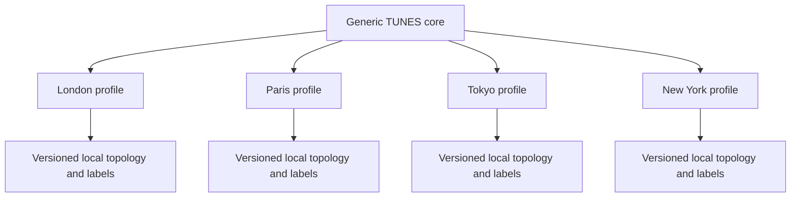

# H17 — Portability

TUNES is London-first, not London-hardcoded. The core model describes generic railway topology, journeys, sections, observations, measurements and provenance; each network supplies versioned configuration.

**For:** maintainers adding networks, researchers comparing cities, and recorder/map implementers.

**Assumptions:** expansion follows validation and local governance; schema portability does not imply launch coverage, data availability, operator participation, or endorsement.

## Core model versus configuration

| Core schema | Network or deployment configuration |
| --- | --- |
| Transport system, operator, line, branch, direction | Local names, identifiers, language and passenger-facing direction labels |
| Station, optional platform, directed section | Topology, interchange edges, branches, stopping patterns and geometries |
| Journey, section, timeline segment and duration | Route-selection rules and alignment priors |
| Rolling stock and carriage-position concepts | Local stock catalogue and passenger-friendly carriage labels |
| Measurements, calibration, flags, confidence | Supported device profiles, campaign protocols and quality gates |
| Versioned observation and release provenance | Data-source licences, network-profile version and release scope |
| Objective/subjective separation | Localised survey wording and accessibility review |

Configuration must not redefine acoustic quantities or weaken claim, privacy, consent, or reproducibility rules.

## Network application

| Network | What remains unchanged | What becomes configuration |
| --- | --- | --- |
| **London Underground** | Directed station-to-station sections, duration, observation and quality model | London profile, line/branch topology, local direction labels, stock and map geometry |
| **National Rail** | Same section and measurement contracts | Operator/service instances, stopping patterns, shared stations, route and stock data |
| **Paris Metro** | Same generic entities and provenance | Local systems, lines, station identifiers, labels, topology and licences |
| **Tokyo Metro** | Same objective/subjective separation and release versioning | Local systems/operators, multilingual labels, service patterns, topology and licences |
| **NYC Subway** | Same journey, directed section and confidence model | Local routes/services, direction labels, stopping patterns, branches and licences |

These rows state how a profile would be represented. They do not claim that profiles, imports, partnerships, or validated collectors for Paris, Tokyo, or New York already exist.

## Why the core does not change

- A city adds instance rows and a versioned network profile, not city-specific entity classes.
- Direction uses stable IDs plus local labels; it is not limited to “eastbound/westbound”.
- Branches and optional service/trip entities represent divergent and stopping-pattern complexity.
- Shared stations and multiple operators are relationships, not schema exceptions.
- Section identity is stable within a network-profile version and remains interpretable with old releases.
- Local map geometry changes presentation, not measurement meaning.

Portability also has scientific limits. Different stock, tunnels, weather exposure, operating practices, device populations, languages, and passenger expectations affect observations. Cross-city comparison therefore requires compatible protocols and uncertainty analysis; schema compatibility alone is not scientific comparability.

## Addition checklist

1. Define scope and ownership; preserve non-affiliation language.
2. Confirm source licences before importing topology or operational data.
3. Create a versioned network profile with stable opaque IDs and localised labels.
4. Validate legal paths through topology, branches, directions and stopping patterns.
5. Test route selection, offline recording, alignment and correction in the local network.
6. Characterise devices, stock and environmental conditions; do not inherit London accuracy assumptions.
7. Publish profile, schema, pipeline, limitations and release IDs together.

> Future work
>
> Only a minimal London Underground profile stub exists in `v0.1.0`. Full London, National Rail, Paris, Tokyo and New York profiles; localisation contracts; service-pattern rules; and cross-city comparability protocols are not yet defined.

## Related Documents

[What is TUNES](./H01-what-is-tunes.md) · [Repos](./H02-repos.md) · [Schema](./H16-schema.md) · [Assumptions](./H18-assumptions.md) · [Railway journey model](./machine/research/06-railway-journey-model.md) · [Generic schema ADR](./machine/decisions/ADR-002-generic-railway-schema.md) · [Initial network scope ADR](./machine/decisions/ADR-001-initial-network-scope.md) · [Network-profile schema](../schemas/v0.1.0/network-profile.schema.json)
